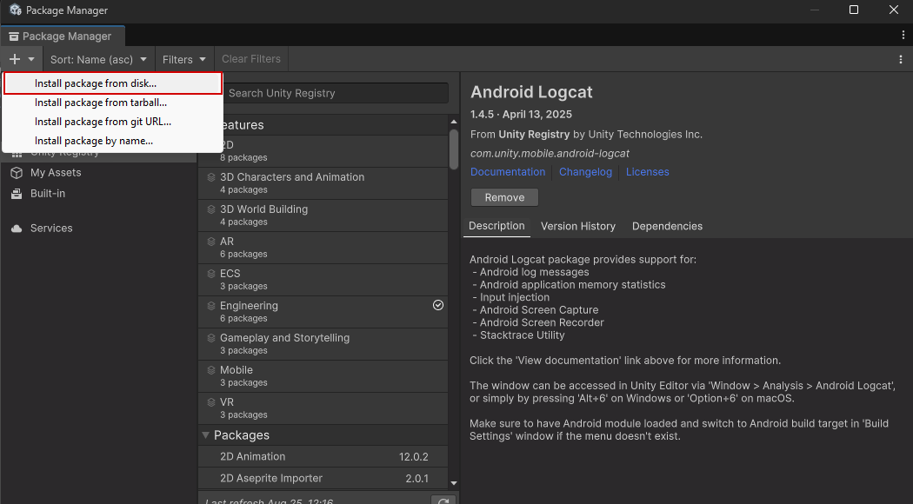

# YOLO Tools

A YOLO toolkit for performing real-time YOLO object-detection in Unity. YOLO Tools can be used as a standalone package
outside of this project. It provides all the functionality used in this project as well as additional 
functions and capabilities for a streamlined YOLO experience in Unity.

## Requirements

- [Unity 6000.0.20f1](https://unity.com/releases/editor/whats-new/6000.0.20#installs) with Android Build Support
  - Note: Whilst it is possible to open the project in Unity Editor Version 6000.0.20f1 or *later*, it is not recommended as this can cause bugs. Proceed at your own risk.
- Horizon OS version 76
- The following permissions are required to use the Object Display Manager:
  - `com.oculus.permission.USE_SCENE`
- The following permissions are required to use the WebCamTextureManager:
  - `horizonos.permission.HEADSET_CAMERA`
  - `android.permission.CAMERA`

## Installation

### Unity Package Manager

To install using the Unity Package Manager, click the `+` icon in the top left of the package manager and select `Install package from disk...`. Navigate to the YOLOTools folder and
select the [`package.json`](package.json) file. This will automatically install all necessary dependencies from
the Unity registry. All other necessary packages are included within YOLOTools.

### Installing Manually

The package can also be installed manually simply by copying the folder into your project, however the dependencies listed in
[package.json](package.json) will need to be installed manually or the package will not function.

