# Examples

These examples are all based on Unity 6000.0.20f1

## Remote Object Detection and Display

### Importing YOLO Tools

To import the YOLO Tools toolkit, open the Unity Package Manager by selecting
Window > Package Manager from the top bar menu.


#### Installing From Disk

Select the `+` icon in the top left of the Package Manager window and select `Install package from disk...`.
Select the `package.json` file in the `YOLOTools` and click `Open` to install the package. This 
will install all necessary dependencies from the Unity Registry.

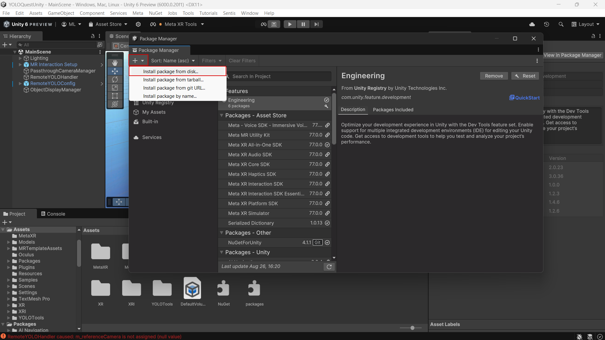

#### Installing from Git

Select the `+` icon in the top left of the Package Manager window and select `Install package from git URL...`.
Enter the url of a git repository hosting the package ([feel free to use this one](https://github.com/matthewlyon23/YOLOTools)) and 
click `Install`. If the package is in a subdirectory of the repository, this can be specified with the [`path` query
parameter](https://docs.unity3d.com/6000.2/Documentation/Manual/upm-git.html#subfolder).

```
https://github.com/matthewlyon23/YOLOQuestUnity.git?path=/Assets/YOLOTools
```

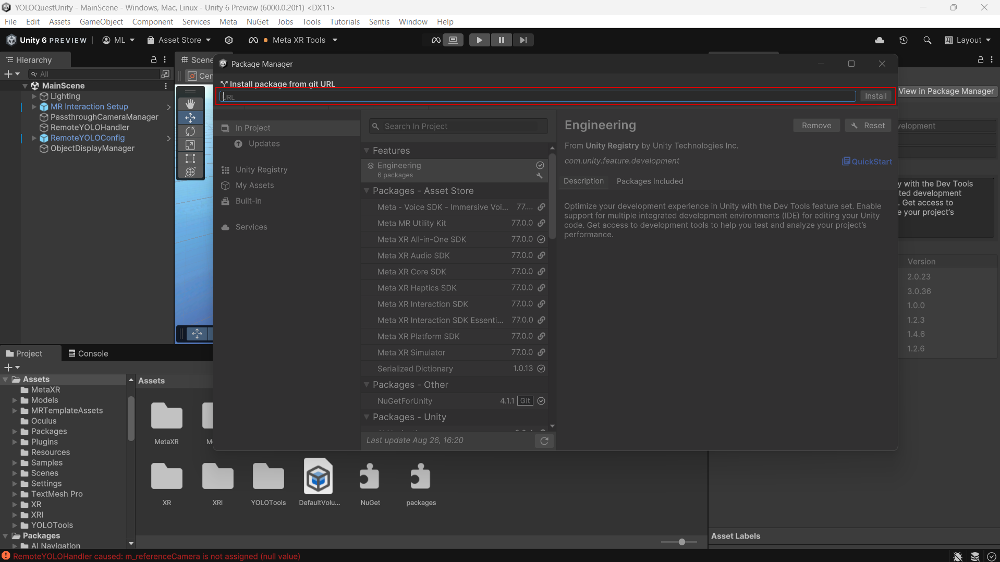

### Scene Setup

The following example shows how you might set up the project for the default
object detection and display use case. It shows every step required to create a project.

First, create a valid Unity XR scene. How you achieve this depends on your needs, but the
easiest way is to use the Mixed Reality template available in the Unity Hub.

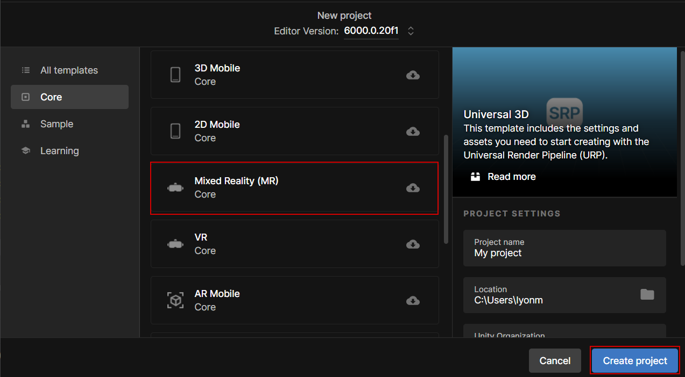

### OVR and Passthrough Setup

Once you have a valid scene, you must add the OVRCameraRig and OVRPassthroughLayer components
from the Meta SDK. The easiest way to do this is via the building blocks menu. Simply drag the
Camera Rig and Passthrough building blocks into the project and use the Meta Setup Tool to ensure they are configured
correctly.

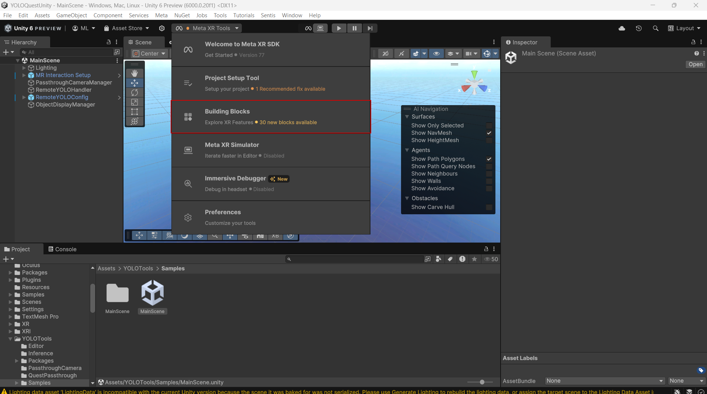
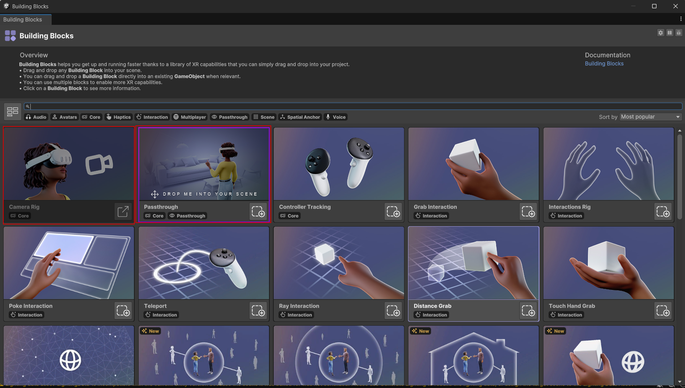

In the `OVRCameraRig` component, select the `Use Per Eye Cameras` option. In the `Quest Features` section
of the `OVRManager` component, ensure that Scene, Passthrough and Boundary Visibility Support are all set
to `Required`. Ensure `Enable Passthrough` and `Should Boundary Visibility Be Supressed` are selected.

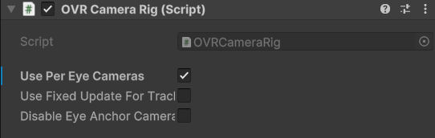

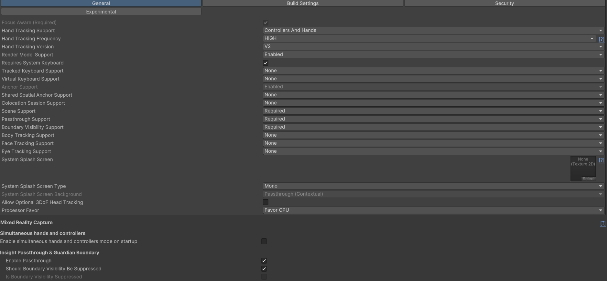

### VideoFeedManager and Passthrough Capture

With Insight Passthrough set up and enabled, the YOLOTools components can now be added to the scene.

First, add a `VideoFeedManager` of your choice that will provide that textures which will be analysed
using YOLO. In this case, we will use the `WebCamTextureManager` component to get the 
feed from the Meta Quest front-facing cameras.

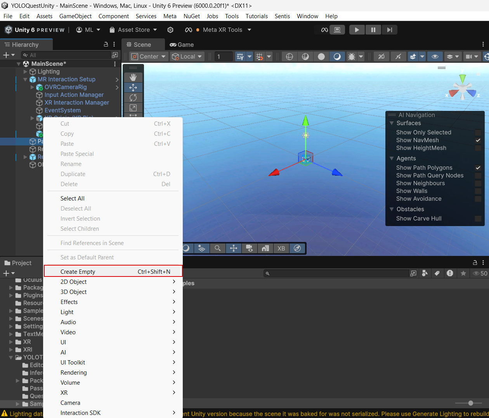

Create an empty object by right-clicking in the scene hierarchy and selecting 
`Create Empty`. Name this object `PassthroughCameraManager`. Click `Add Component` in
the inspector for the object and search for `WebCamTextureManager` and add it to the object.
Ensure you also add the `PassthroughCameraPermissions` script in the same way.

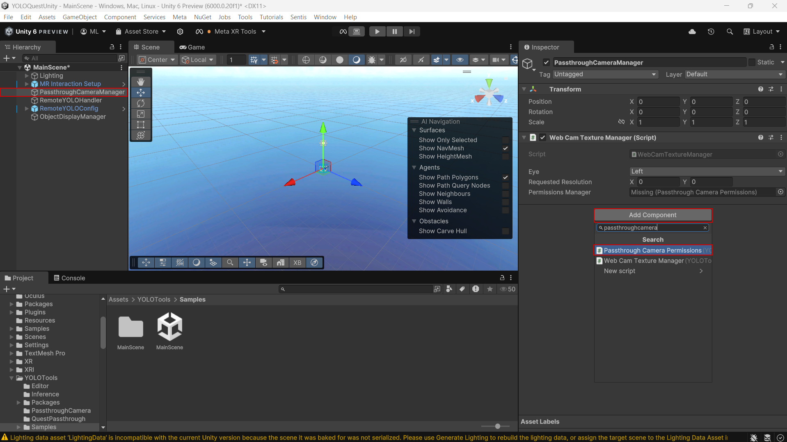

Finally, drag the `PassthroughCameraPermissions` component into the `PermissionsManager` field of the `WebCamTextureManager`
component. You can optionally select either the left or the right eye to use for Passthrough Capture.

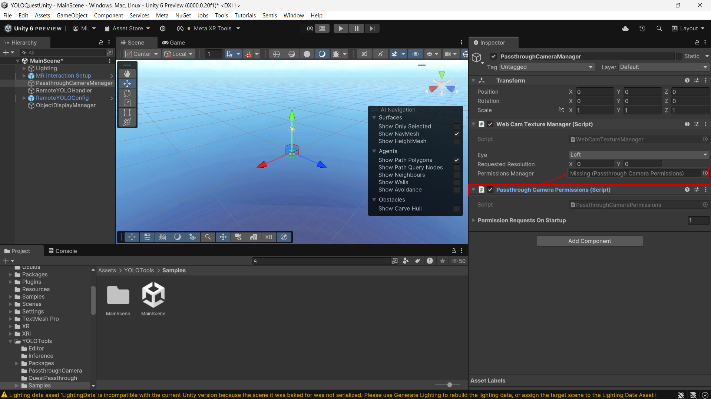

### YOLO Analysis

To perform YOLO analysis, you can use either the `YOLOHandler` component or the
`RemoteYOLOHandler` component depending on your needs. For this example,
we will use the `RemoteYOLOHandler`.

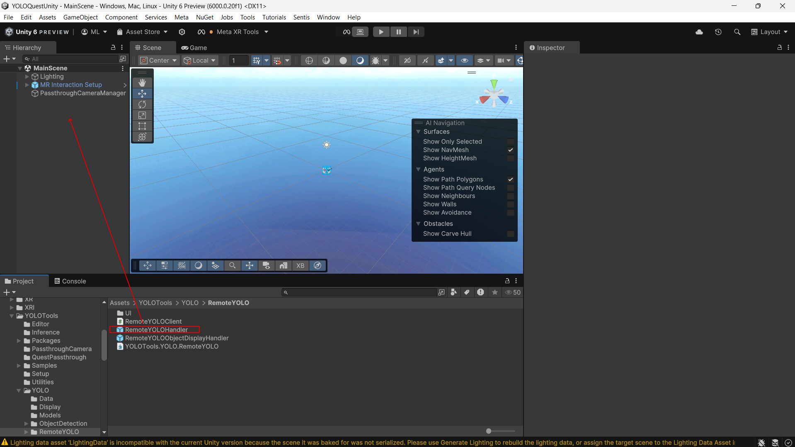

To use the `RemoteYOLOHandler`, drag the `RemoteYOLOHandler` prefab into the scene hierarchy. Select
the `RemoteYOLOHandler` object in the scene hierarchy and fill in the `Remote YOLO Processor Address`,
`YOLO Format`, `YOLO Model` and `Use Custom Model` fields.

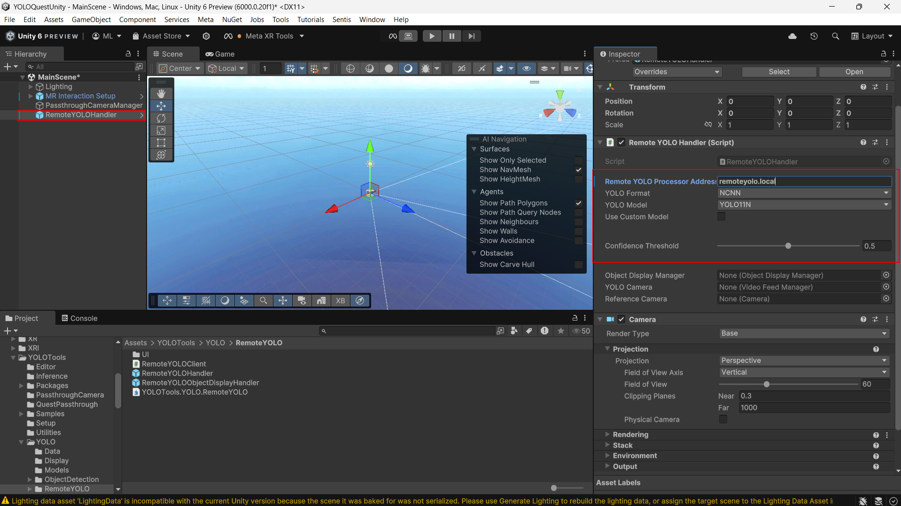

Drag the `PassthroughCameraManager` object (or your `VideoFeedManager` of choice) into the `Video Feed Manager`
field of the `RemoteYOLOHandler`. 

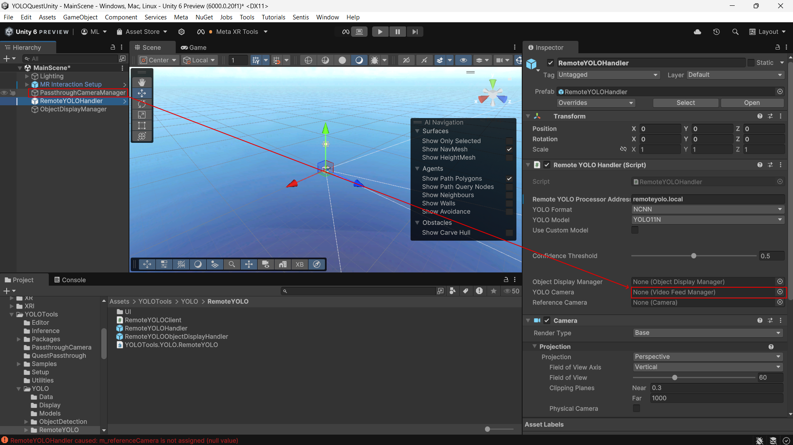

Click on the circle icon next to the `Reference Camera` field of the `RemoteYOLOHandler`
and select the `Camera` object you wish to use as the virtual camera in the scene. This should be the
camera most closely aligned with the real `VideoFeedManager` source. In this example, the `Left Eye Camera`
object of the OVRCameraRig is used.

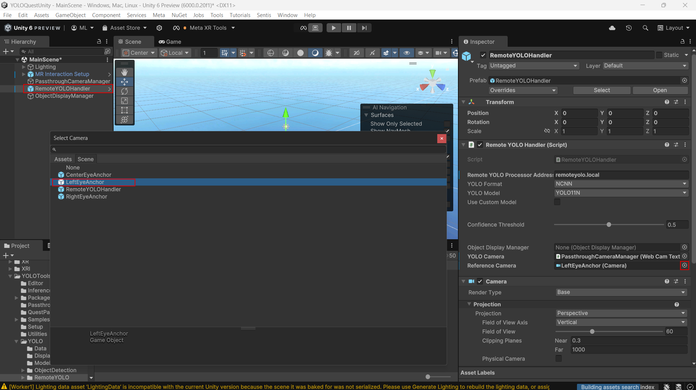

### Object Display

Right click in the scene hierarchy and select `Create Empty`. This time, name the object `ObjectDisplayManager`.
Click on the object to open the inspector, select `Add Component` and search for `ObjectDisplayManager` to add the `ObjectDisplayManager`
component.

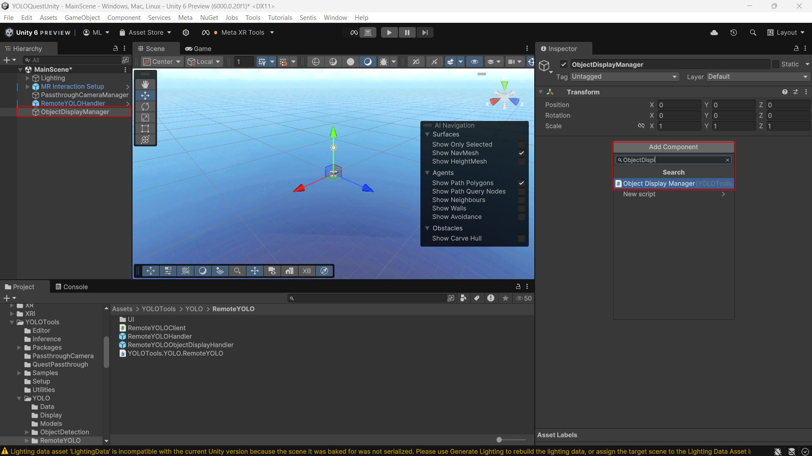

Use the same method to add an `EnvironmentRaycastManager` component from the Meta SDK to the `ObjectDisplayManager`
object.

Tweak the `ObjectDisplayManager` settings as desired. See the [manual](manual.md) for information on the configuration
options that are available.

Drag the `PassthroughCameraManager` object (or your `VideoFeedManager` object of choice) into the `Video Feed Manager` field of the `ObjectDisplayManager`.


Finally, drag the `ObjectDisplayManager` into the `Object Display Manager` field of the `RemoteYOLOHandler`.

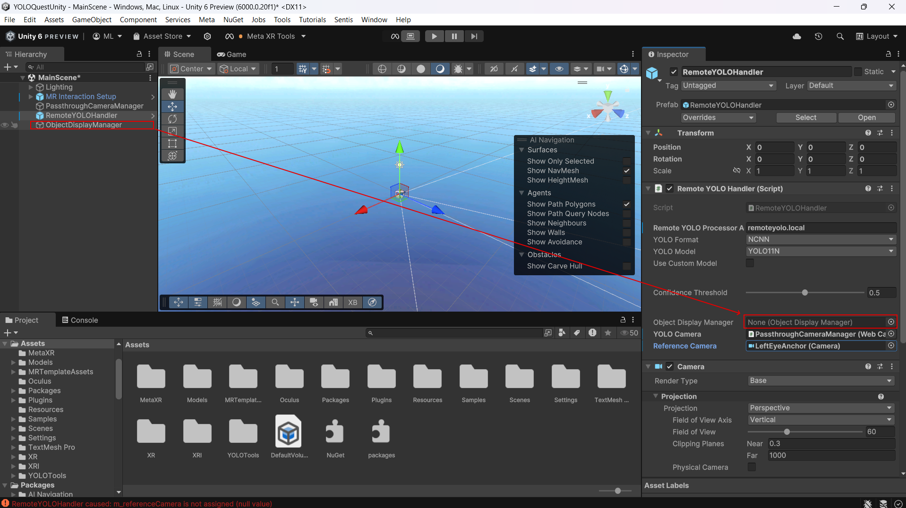
